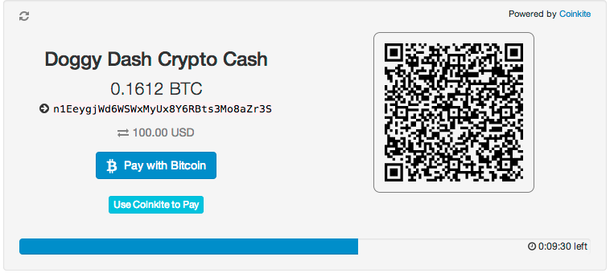
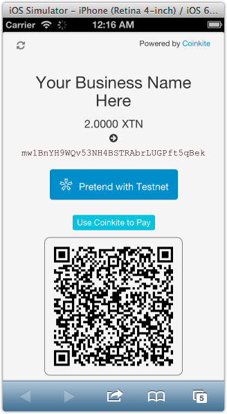
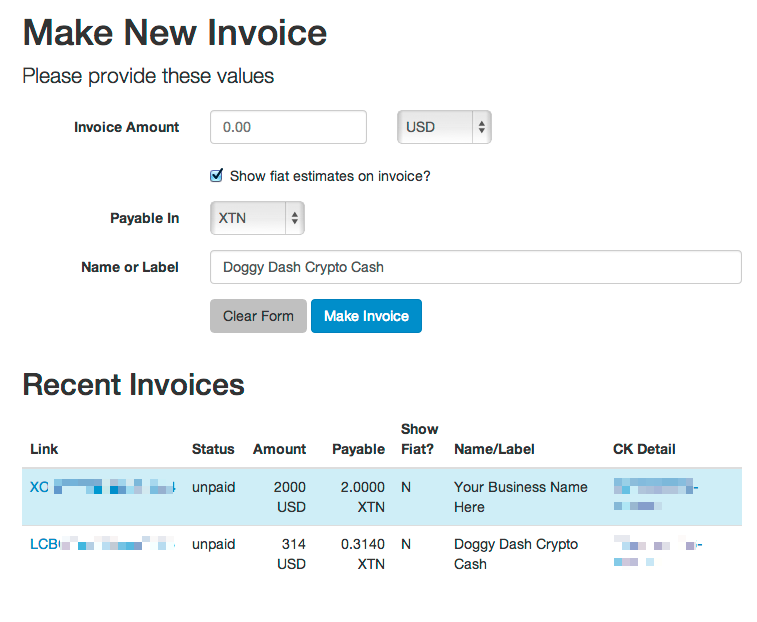

# Real Time Invoice System

This is a Google App Engine demo project, showing a Bitcoin (or Litecoin or BlackCoin)
invoicing system.

It produces nice-looking QR and BIP-compliant payment links for the
amount, and has the customary time-limit, with animated count down,
to indicate the exchange rate quote timeout.

Most important of all, real-time sensing of completed payment is
demonstrated: Once the payer sends a transaction to the pubkey, the
invoice immediately clears and thanks the payer.

Other features:

- Support all fiat currencies from Coinkite, plus all cryptos.
- QR codes rendered directly into the page's HTML as SVG objects (faster, resolution independent).
- Bootstrap v3 for responsive design: works on iPhones and desktops.
- Demonstrates the Coinkite python API library (`ckapi`) on GAE.
- Open source, so run with it!

[Learn more about Coinkite's API here](https://docs.coinkite.com/)
and visit the [Coinkite Main Site](https://coinkite.com/) to open your
account today!

## The Demo

<https://ck-rt-invoice.appspot.com>

See a live [Bitcoin Invoice demo here.](https://ck-rt-invoice.appspot.com/example.btc) 
(The data shown is placeholder, so don't try to pay it!)

[Litecoin and Blackcoin examples](https://ck-rt-invoice.appspot.com) can be reached
from the site home page.

### Example Invoice

### Responsive Layout 

### Making a New Invoice

## How To Run Locally

Clone this repo:

	git clone git@github.com:coinkite/coinkite-real-time-invoice.git

Then update the submodules:

	git submodule update

Get an API key for your Coinkite account. It should have `recv`, `read` and `events`
permissions and access to the related accounts.
Edit `settings.py` to insert your API key for it to use.

Then run Google AppEngine... (this can also be done via their GUI).

	dev_appserver.py app.yaml
	open http://localhost:8080

## Usage

Go to `/make` to see a list of invoices and their status. You may also create new
invoices on that page, simply by specifying an amount and currency type.

Invoices are presented at `/invoice/<token>` where token is a random
code.  This is the URL you would give out to your customers via
email or whatever.

## Code Layout

- `static/` Static assets: CSS and Javascript files.
- `templates/` HTML templates (Jinja2) format
- `app.yaml` AppEngine configuration
- `index.yaml` GAE indexing
- `lib/` Python modules, loaded as submodules with symlinks
- `main.py` Mainline code.
- `models.py` Database models (one -- an invoice)
- `settings.py` Coinkite API keys.

## Confirmations

This system works on zero-confirmation (in BTC), which isn't
appropriate for real money. It should have different messaging for
zero and one confirmations and fully-confirmed amounts. Of course,
you want to acknowledge the payment on zero confirmation, but you
shouldn't ship any goods without at least one confirmation.

## More about Coinkite

Coinkite is the world's easiest and most powerful web wallet for
safely holding all your cryptocurrencies, including Bitcoin and Litecoin.

[Learn more about all we offer](https://coinkite.com/)

